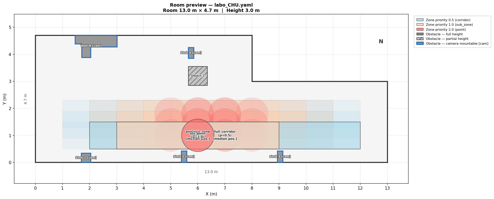
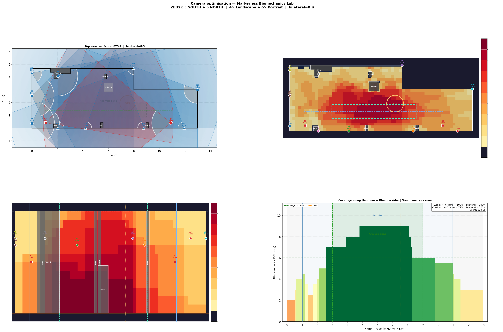

# Lab Camera Optimizer

**Optimal camera placement for markerless biomechanics motion capture labs.**

Given a room layout, a set of cameras and a capture zone, this tool finds the
configuration that maximises 3D body coverage (head-to-toe visibility) across
all evaluation points, with optional bilateral coverage constraints.


---

## Features

- **Two capture modes** — **markerless** (whole-body pose, the default) and **marker-based** (optoelectronic systems like OptiTrack/Vicon: each body marker must be triangulated by ≥2 cameras, with body self-occlusion modelled)
- **Any room shape** — define any polygon floor plan (L-shaped, rectangular, etc.)
- **Obstacles & walls** — pillars, partial-height furniture, irregular wall segments
- **Multiple camera sets** — wall-mounted cameras + tripod cameras, both placed by the same zone-wide optimiser
- **Camera budget** — fix an exact count per set, *or* give a total and let the optimiser choose the wall/tripod split (`total_cameras` + per-set `count_min`/`count_max`)
- **Per-camera height variation** — each camera in the same configuration can be at a different height
- **3D visibility** — checks both horizontal FOV and vertical body coverage (0 → subject height)
- **Line-of-sight** — occlusion by walls and floor-to-ceiling obstacles
- **Bilateral constraint** — ensures coverage from both sides of the capture axis (configurable weight)
- **Zone sweep** — automatically tests multiple corridor/polygon zone positions and finds the best layout
- **Consensus / robustness analysis** — optionally reports which camera positions and aim angles are *robust* (agreed by most near-best configs) vs flexible, so you know how much to trust the result
- **Room preview** — top-down visualisation of your room before running optimisation
- **YAML configuration** — no code editing required to adapt to your lab

> **Want to understand how it works?**  
> See [ALGORITHM.md](ALGORITHM.md) for a full explanation of the scoring
> function, the greedy optimisation, the combo sweep and all tuning parameters.

---

## Preview

### Room layout (`preview_room.py`)


### Optimisation result


---

## Installation

### Option A — pip install (recommended)

```bash
pip install lab-camera-optimizer
```

Then initialise a working directory with the example configs:

```bash
mkdir my-lab && cd my-lab
lab-camera-init
```

This copies the example YAML configs into `configs/` and creates the `outputs/`
folder in your current directory. Three commands are then available:

```bash
lab-camera-init                                        # copy example configs (run once)
lab-camera-preview   --config configs/example_simple.yaml
lab-camera-optimizer --config configs/example_simple.yaml
```

### Option B — Clone and run locally

```bash
git clone https://github.com/flodelaplace/lab-camera-optimizer.git
cd lab-camera-optimizer
pip install -r requirements.txt
python optimize.py     --config configs/example_simple.yaml
python preview_room.py --config configs/example_simple.yaml
```

Python ≥ 3.10 recommended.

---

## Quick start

### 1. Preview your room layout

Before running the (potentially long) optimisation, always verify your room
geometry, obstacles and capture zones visually:

```bash
python preview_room.py --config configs/example_simple.yaml
```

This saves a top-down PNG to `outputs/preview_room/` and opens an interactive
window. Use it every time you modify your config to catch geometry errors early.

> **Tip:** `preview_room.py` can be run standalone at any time — it does not
> require the optimiser to have been run first.

### 2. Run the optimiser

```bash
python optimize.py --config configs/example_simple.yaml
```

The room preview is shown automatically at startup. Close the window to start
the optimisation. To skip the preview (e.g. for batch runs):

```bash
python optimize.py --config configs/example_simple.yaml --no-preview
```

Results are saved in `outputs/`:
- `FINAL_RESULT_*.png` — 4-panel figure (top view, heatmap, side view, coverage bar chart)
- `graphs/` — intermediate graphs for each optimisation attempt
- `graphs_optimal/` — best result per zone combination, ranked by score
- `log_*.txt` — full optimisation log
- `preview_room/` — room layout previews

---

## Adapting to your lab

### Step 1 — Choose a starting config

| File | Description |
|---|---|
| `configs/example_simple.yaml` | **Start here** — 10×6 m rectangle, one camera set, no obstacles |
| `configs/example_real_world.yaml` | Full real-world example — L-shaped room, obstacles, two camera sets, corridor |
| `configs/T_zone_direction_change.yaml` | T-shaped capture zone for direction-change analysis |

```bash
cp configs/example_simple.yaml configs/my_lab.yaml
```

### Step 2 — Edit `my_lab.yaml`

The YAML file has six sections:

#### `room` — room geometry
```yaml
room:
  corners: [[0,0],[10,0],[10,5],[0,5]]   # (X,Y) vertices in metres, in order
  height: 3.0                             # floor-to-ceiling height (metres)
```

#### `obstacles` — walls, pillars, furniture
```yaml
obstacles:
  - type: polygon
    vertices: [[1.0,0.0],[1.2,0.0],[1.2,0.5],[1.0,0.5]]
    height: 3.0          # = room height → fully blocks line-of-sight
    label: "Pillar A"
    can_mount_camera: false

  - type: polygon
    vertices: [[2,0],[2,1],[3,1],[3,0]]
    height: 1.2          # partial height → cameras can see over it
    label: "Table"
    can_mount_camera: false
```

> **Tip:** run `python preview_room.py --config configs/my_lab.yaml` after every
> obstacle addition to verify the geometry looks right before optimising.

#### `subject` — person being recorded
```yaml
subject:
  height: 1.9      # metres
  foot_z: 0.0
```

#### `camera_sets` — define your cameras
```yaml
camera_sets:
  - id: "cam_A"
    name: "My Camera"
    mounting: "wall"           # wall | tripod
    fov_h_landscape: 110.0
    fov_v_landscape:  70.0
    fov_h_portrait:   70.0
    fov_v_portrait:  110.0
    height_options: [2.0, 2.2] # tested heights (metres)
    max_range: 10.0
    min_range: 0.5
    count_max: 8               # max cameras of this set (alias: max_count)
    count_min: 0               # min cameras of this set (free mode only)
    min_spacing: 1.2
    score_weight: 1.0          # weight of this set in the score
    score_factor: 1.0          # extra per-set multiplier (e.g. 0.5 to down-weight)
    color: "#1f77b4"
```

#### Camera budget — fixed vs free allocation

```yaml
optimization:
  # total_cameras absent → FIXED: each set places exactly its count_max
  #   (wall-only: tripod count_max 0; "5 wall + 3 tripod": set each count_max)
  # total_cameras present → FREE: the optimiser splits the total across sets
  #   within each set's [count_min, count_max] to maximise the score.
  total_cameras: 8
```

#### `capture_zones` — where coverage matters

**Corridor-based** (walking path):
```yaml
capture_zones:
  - id: "full_corridor"
    type: "corridor"
    priority: 0.5
    length: 10.0
    width: 1.0
    placement:
      x_start_options: [1.0, 2.0]
      y_options: [1.5, 2.0]

  - id: "analysis_zone"
    type: "sub_zone"
    priority: 1.0
    length: 6.0
    contained_in: "full_corridor"
    offset_options: [1.0, 2.0, 3.0]

  - id: "key_point"
    type: "point"
    priority: 2.0
    radius: 0.5
    contained_in: "analysis_zone"
    auto_optimize: true
```

**Polygon-based** (arbitrary shape — L, T, cross…):
```yaml
capture_zones:
  - id: "approach"
    type: "polygon"
    priority: 1.0
    grid_step: 0.30
    vertices:
      - [0.0, 0.0]
      - [6.0, 0.0]
      - [6.0, 1.0]
      - [0.0, 1.0]
    placement:
      x_offsets: [0.0, 0.5]
      y_offsets: [2.0, 2.5]
```

#### `optimization` — tuning parameters
```yaml
optimization:
  capture_mode: "markerless"   # markerless | markerbased   (see below)
  target_coverage: 4           # cameras per evaluation point
  bilateral_weight: 0.8        # 0 = disabled, 1 = fully enforced
  vertical_coverage_threshold: 0.9
  restarts_per_combo: 15
  total_cameras: null          # null = fixed mode; an int = free allocation
  consensus_topk: 0            # >0 = run the consensus analysis on the top-K configs
  algo: "greedy_1opt"          # greedy | greedy_1opt
  early_stop: 5                # stop after N restarts with no improvement
  graph_mode: "best_per_combo" # all | records_only | best_per_combo
  wall_step: 0.35
  angle_steps: 24
  tripod_grid_step: 0.70
  distance_quality_factor: 0.001
```

### Capture mode — markerless vs marker-based

Set `optimization.capture_mode`:

**`markerless`** (default) — for whole-body pose estimation (e.g. ZED cameras).
A camera "covers" an evaluation point when it sees enough of the **whole body**
(controlled by `vertical_coverage_threshold`); the score rewards several
well-placed, angularly-diverse views per point.

**`markerbased`** — for optoelectronic systems (OptiTrack, Vicon…). Here the goal
is different: **each body marker must be seen by at least `triangulation_min`
cameras** (default 2) to be reconstructed in 3D. So:

- whole-body framing is *not* required — a marker only needs to be in frame;
- a point scores 0 unless it is seen by ≥ `triangulation_min` **angularly-distinct**
  cameras (you cannot triangulate a marker from a single view);
- optionally, `marker_body: cylinder` models the subject as a cylinder with
  markers around it, so **markers on the far side are occluded by the body
  itself** — this pushes the optimiser to *surround* the capture volume.

```yaml
optimization:
  capture_mode: "markerbased"
  triangulation_min: 2      # min cameras that must see a marker to reconstruct it
  marker_body: "cylinder"   # none | cylinder  (cylinder adds body self-occlusion)
  marker_ring: 8            # markers around the body circumference
  marker_levels: 4          # marker heights (foot → head)
  body_radius: 0.20         # cylinder radius (m)
```

In marker-based mode the result figure is a **marker-reconstruction** view: a
floor heatmap of the % of body markers reconstructable at each position, a
breakdown by body height, and the % along the walk axis.

> **Tip:** marker-based benefits from more **varied camera heights** (to cover
> foot→head markers and reduce occlusion) than markerless.

### Consensus / robustness analysis

Because the score is a heuristic that can be nearly flat (several quite different
layouts scoring almost the same), set `consensus_topk: 40` to aggregate the
top-K configs of the **winning zone** and find out what is actually robust:

- **`CONSENSUS.png`** — a density map of where cameras land across the top-K,
  with the most-representative (medoid) config overlaid: each camera shows an
  **aim arrow**, its sensor orientation (Portrait/Landscape), mount height and
  **downward tilt**, plus its **position agreement** (% of top-K that place a
  camera there) and **aim-angle agreement**.
- **`consensus_topk.json`** — the top-K configs, so you can re-analyse offline.
- The log reports the score spread (is it really a tie?), the stable vs flexible
  positions, and the medoid score.

Cameras agreed by ≥70% of the top-K are *robust* (place them confidently);
the rest are *flexible* (adjust to physical constraints with little score loss).

> **Note:** the `point` (STS) capture zone is **optional**. With no `point` zone
> declared, cameras simply optimise coverage of the corridor / analysis /
> polygon zones — useful for tripod-only or pure zone-wide setups.

### Step 3 — Preview, then run

```bash
# Verify geometry
python preview_room.py --config configs/my_lab.yaml

# Run optimisation
python optimize.py --config configs/my_lab.yaml
```

---

## Output explained

| Panel | Description |
|---|---|
| Top-left: **Top view** | Room plan + camera cones. Grey = blind zone. Coloured = useful coverage. |
| Top-right: **XY heatmap** | Number of cameras covering each floor position in 3D. |
| Bottom-left: **XZ side view** | Number of cameras covering each height slice along the room length. |
| Bottom-right: **Coverage bar chart** | Camera count per X position along the corridor. Green = target reached. |

### Example terminal output

```
=================================================================
  OPTIMAL CONFIGURATION
=================================================================
Score: 829.08
Bilateral:  SOUTH=939.9 (49%)  NORTH=981.1 (51%)  balance=96% OK

Wall cameras (cam_A):
  A 1 [L][S]  pos=(0.00m, 0.36m)  h=2.2m
       Pan: 10deg to the RIGHT  |  Tilt: 50.3deg downward
  A 2 [P][S]  pos=(8.78m, 0.00m)  h=2.0m
       Pan: 55deg to the RIGHT  |  Tilt: 36.9deg downward
  A 3 [P][S]  pos=(4.22m, 0.00m)  h=2.0m
       Pan: 55deg to the LEFT   |  Tilt: 36.9deg downward
  A 4 [P][S]  pos=(11.95m, 0.00m)  h=2.2m
       Pan: 55deg to the RIGHT  |  Tilt: 41.8deg downward
  A 5 [P][N]  pos=(8.00m, 4.70m)  h=2.2m
       Pan: 55deg to the RIGHT  |  Tilt: 20.7deg downward
  A 6 [L][N]  pos=(0.00m, 2.53m)  h=2.0m
       Pan: 10deg to the LEFT   |  Tilt: 42.9deg downward
  A 7 [P][S]  pos=(2.04m, 0.00m)  h=2.2m
       Pan: 55deg to the LEFT   |  Tilt: 41.8deg downward
  A 8 [L][N]  pos=(2.04m, 4.07m)  h=2.2m
       Pan: 35deg to the LEFT   |  Tilt: 25.0deg downward
  A 9 [P][N]  pos=(0.00m, 4.34m)  h=2.2m
       Pan: 25deg to the LEFT   |  Tilt: 23.0deg downward
  A10 [L][N]  pos=(13.00m, 3.00m)  h=2.2m
       Pan: 35deg to the RIGHT  |  Tilt: 38.0deg downward

Tripod cameras (cam_B):
  B1 [P]  pos=(1.10m, 0.40m)  h=1.5m  angle=20deg   tilt=28.8deg
  B2 [L]  pos=(10.90m, 0.40m)  h=1.5m  angle=180deg  tilt=28.8deg
=================================================================
```

Each camera line gives:
- `[L]`/`[P]` — landscape or portrait orientation
- `[S]`/`[N]` — south or north side of the capture axis
- `pos` — XY position on the wall (metres)
- `h` — mounting height (metres)
- **Pan** — horizontal angle left/right from the wall normal
- **Tilt** — vertical angle downward toward the subject

---

## Room coordinate system

```
Y
^
|
|  (room interior)
|
+-----------> X
(0,0)
```

- **X axis**: room length (left → right)
- **Y axis**: room width (bottom → top)
- **Z axis**: height (floor = 0)
- **Angles**: 0° = East (+X), 90° = North (+Y), 180° = West (−X)

---

## How it works

The full technical documentation is in **[ALGORITHM.md](ALGORITHM.md)**. Here is a short summary:

| Component | Description |
|---|---|
| **Sample grid** | Evaluation points distributed across capture zones, weighted by `priority` |
| **Unified engine** | Wall and tripod cameras are placed by the same routine (diverse init → 1-opt → reorient) |
| **Score (markerless)** | `v²` (whole-body coverage) × `dist_quality` × bilateral × angular diversity, per point |
| **Score (marker-based)** | Each marker needs ≥2 angularly-distinct views; `cylinder` body model adds self-occlusion |
| **Camera budget** | Fixed count per set, or a total the optimiser splits across sets (`total_cameras`) |
| **Combo sweep** | Tests combinations of zone positions and keeps the globally best |
| **Consensus** | Optional: reports which camera positions/angles are robust vs flexible across the top-K |
| **Performance** | Per-combo coverage is precomputed once so the search is table-lookups, not re-geometry |

> Full technical documentation — scoring, algorithm, both capture modes, the
> consensus and every parameter — is in **[ALGORITHM.md](ALGORITHM.md)**.

---

## Publication

Presented at **JED 2026**:

- 📄 [Abstract (PDF)](docs/JED26_abstract_FD.pdf)
- 🖼️ [Poster (PDF)](docs/JED26_poster_FD.pdf)

## Citing this tool

If you use this tool in a research publication, please cite it using the
`CITATION.cff` file at the root of this repository (GitHub shows a
*"Cite this repository"* button automatically).

> Delaplace F. — *Lab Camera Optimizer: automated camera placement for
> markerless biomechanics motion capture laboratories* — 2026.

---

## License

This project is licensed under the **MIT License** — see the
[LICENSE](LICENSE) file for details.

---

## Contributing

Pull requests and issues are welcome.
Please open an issue before submitting large changes.

